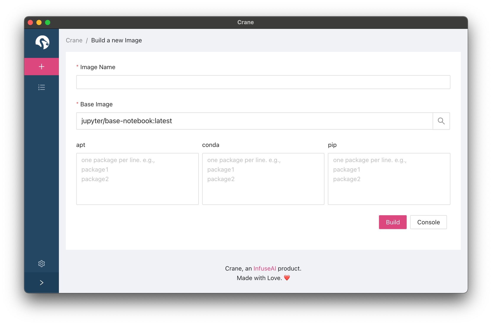

[](https://discord.com/invite/ZE8pQ8gRWy)

An easier, mode modern way to manage your docker images.

> Like crane? Crane works better with [PrimeHub](https://primehub.io). Crane is the best companion of PrimeHub when it comes to managing docker images. [Try PrimeHub Now](http://one.primehub.io/) and join our [discord community](https://discord.com/invite/ZE8pQ8gRW)!


## How to run

### Requirement

- Node JS >= 14
- Yarn
- cross-env

### Run with dev mode

```bash
yarn install
yarn dev
```

### Run with VSCode debugger

1. Open the project with VSCode

2. Click `Run and Debug` tab

3. Click `JavaScript Debug Terminal`


4. Exec the following commands in the JavaScript Debug Terminal

```bash
cross-env FORCE_BACKGROUND_PROCESS=1 yarn dev
```
