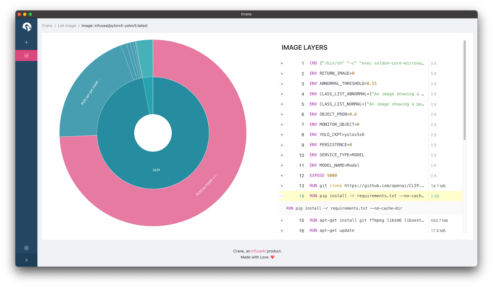

An easy and beautiful way to manage and build your container images.

Crane helps people building machine-learning notebook container images.

Check [this article](https://medium.com/infuseai/crane-the-minimalist-container-image-builder-68253722be8c) for more initiatives about Crane.

> Like crane? Crane works better with [PrimeHub](http://one.primehub.io/). Crane is the best companion of PrimeHub when it comes to managing docker images. [Try PrimeHub Now](http://one.primehub.io/) and join our [discord community](https://discord.com/invite/ZE8pQ8gRW)!

## Install

Download the latest version from our [releases](https://github.com/infuseAI/crane/releases) page.

## Features

### Building a Container Image

Install packages with apt, conda and pip, which should work in most notebook images. And you can also find a list of our [pre-built container images](https://docs.primehub.io/docs/guide_manual/images-list) in the Base Image dropdown menu.

### Inspect your own image

Is the large container image slowing you down? Crane's image inspector give you a great overview of the image space usage that visualizes image layer usage to help you reduce the image size.

### Manage Credentials

Manage your remote registry credentials and PrimeHub API token securely. Now **DockerHub** and **AWS ECR** are supported. More on the way.

Credentials are stored safely in the Keychain(MacOS), libsecret(Linux) or Credential Vault(Windows).

### Manage Local And Remote Images

Simple yet informative GUI. For now to manipulate local and remote images.

### Import Remote Image Into PrimeHub

From the Remote Repository list, users can import the image into the connected PrimeHub cluster. This feature only works with public container images for now.

## Let's chat about Crane 🦩

**So, what is Crane?**

Crane is a minimalist container image builder. You can extend an existing container image with custom apt/conda/pip packages without writing any Dockerfile.

**How does Crane work?**

Crane generates Dockerfile that installs packages according to your settings, and builds the container image with your local docker engine. You can also push images to your Docker Hub registry.

**Why do we build Crane?**

Container images are used in many different use cases such as ML. There are lots of ready-to-run container images with Jupyter and various libraries, however people still want to customize images, and this is mostly done through authoring Dockerfile with commands installing additional packages.

Dockerfile is the canonical way for building container images. However, people still want a no-frills way to just simply adding packages to existing images. Crane provides an easier way to build container images without any knowledge of Dockerfile, so the process is more approachable.

We've always had this feature in our open source ML platform PrimeHub to allow customizing container images for a shared and consistent environment. And it's now also available as a standalone desktop app - Crane. 
